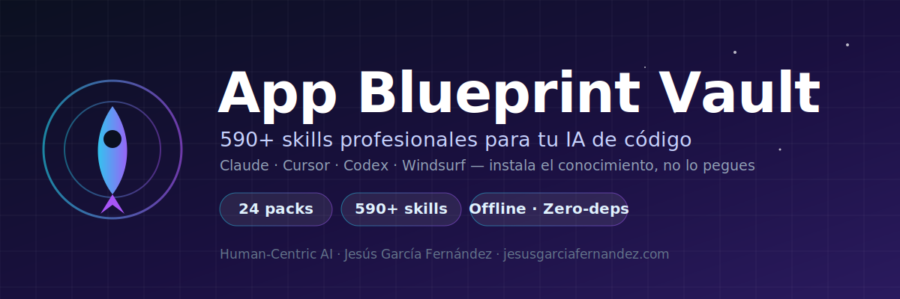

# 🛸 App Blueprint Vault — 24 packs de skills para tu IA de código


> **Convierte cualquier IA (Claude, Cursor, Codex, Windsurf…) en un especialista** con el
> conocimiento de más de 580 skills profesionales, organizadas en 24 áreas.
> Gratis, sin conexión, instalable en 2 minutos.

**¿Quieres aplicar esto en tu empresa o proyecto?**
👉 [https://jesusgarciafernandez.com](https://jesusgarciafernandez.com) · ✉️ [contacto@jesusgarciafernandez.com](mailto:contacto@jesusgarciafernandez.com)

---

## ¿Qué es esto?

Una **bóveda de conocimiento experto** lista para instalar en tu agente de IA. Cada pack reúne
las mejores prácticas de un área (marketing, desarrollo, finanzas, legal, datos…) en formato
de *skill* que la IA activa automáticamente cuando la necesita. Resultado: menos alucinaciones,
más criterio profesional, código y entregables a la altura.

Forma parte de **[App Blueprint Generator](https://github.com/jesusgarciafernandez/app-blueprint-generator)**,
la herramienta que transforma una idea de negocio en un paquete arquitectónico completo para que
una IA lo construya bien a la primera.

## Instalación en 2 minutos

En tu Claude (Code / Cowork):

```bash
# 1. Añade esta tienda de packs
/plugin marketplace add jesusgarciafernandez/app-blueprint-vault

# 2. Instala los packs que quieras
/plugin install marketing-digital@app-blueprint-vault
/plugin install desarrollo-de-software@app-blueprint-vault
```

## ¿Cómo funciona una skill?

Cada skill es un manual técnico con una cabecera (`name` + `description`) que tu IA **lee y activa
sola** cuando la tarea encaja. No tienes que invocarlas: instalas el pack y el agente usa la skill
adecuada en el momento justo. Las skills largas incluyen un `reference.md` que se carga solo cuando
hace falta el detalle (menos consumo, más precisión).

## Los 24 packs disponibles

| Pack | Contenido |
|------|-----------|
| `marketing-digital` | Marketing Digital — 44 skills. |
| `generacion-de-contenido` | Generación de Contenido — 70 skills. |
| `diseno-y-creatividad` | Diseño y Creatividad — 6 skills. |
| `comunicacion-y-marca-digital` | Comunicación y Marca Digital — 24 skills. |
| `gestion-de-leads-y-crm` | Gestión de Leads y CRM — 6 skills. |
| `ventas-y-comercio-electronico` | Ventas y Comercio Electrónico — 19 skills. |
| `atencion-al-cliente` | Atención al Cliente — 8 skills. |
| `estrategia-y-operaciones` | Estrategia y Operaciones — 13 skills. |
| `productividad-y-operaciones` | Productividad y Operaciones — 31 skills. |
| `proyectos-y-colaboracion` | Proyectos y Colaboración — 19 skills. |
| `recursos-humanos` | Recursos Humanos — 47 skills. |
| `finanzas-y-contabilidad` | Finanzas y Contabilidad — 23 skills. |
| `legal-y-cumplimiento` | Legal y Cumplimiento — 37 skills. |
| `datos-y-analitica` | Datos y Analítica — 22 skills. |
| `inteligencia-artificial` | Inteligencia Artificial — 36 skills. |
| `desarrollo-de-software` | Desarrollo de Software — 17 skills. |
| `desarrollo-y-tecnologia` | Desarrollo y Tecnología — 55 skills. |
| `investigacion-e-inteligencia-de-negocio` | Investigación e Inteligencia de Negocio — 37 skills. |
| `comunicacion-y-mensajeria` | Comunicación y Mensajería — 10 skills. |
| `educacion-y-formacion` | Educación y Formación — 18 skills. |
| `eventos-y-webinars` | Eventos y Webinars — 2 skills. |
| `salud-y-bienestar` | Salud y Bienestar — 10 skills. |
| `inmobiliario-y-gestion-de-activos` | Inmobiliario y Gestión de Activos — 5 skills. |
| `logistica-y-operaciones-fisicas` | Logística y Operaciones Físicas — 24 skills. |

## Quién hay detrás

Creado por **Jesús García Fernández**, bajo la filosofía *Human-Centric AI*: la tecnología amplifica el
criterio humano, no lo reemplaza. Más sobre mi trabajo en **[https://jesusgarciafernandez.com](https://jesusgarciafernandez.com)**.

## 🤝 ¿Trabajamos juntos?

Si tu equipo quiere **implantar IA con criterio** —consultoría, desarrollo a medida, formación
o adaptar esta bóveda a tu sector— hablemos:

- 🌐 Web y servicios: **[https://jesusgarciafernandez.com](https://jesusgarciafernandez.com)**
- ✉️ Escríbeme: **[contacto@jesusgarciafernandez.com](mailto:contacto@jesusgarciafernandez.com)**

## Licencia

Skills bajo **CC BY-NC-SA 4.0**: uso libre no comercial **citando la fuente** (Jesús García Fernández).
Para uso comercial, contáctame. · Versión de la bóveda: 2.0.0

---
*App Blueprint Vault v2.0.0 — Jesús García Fernández.*
